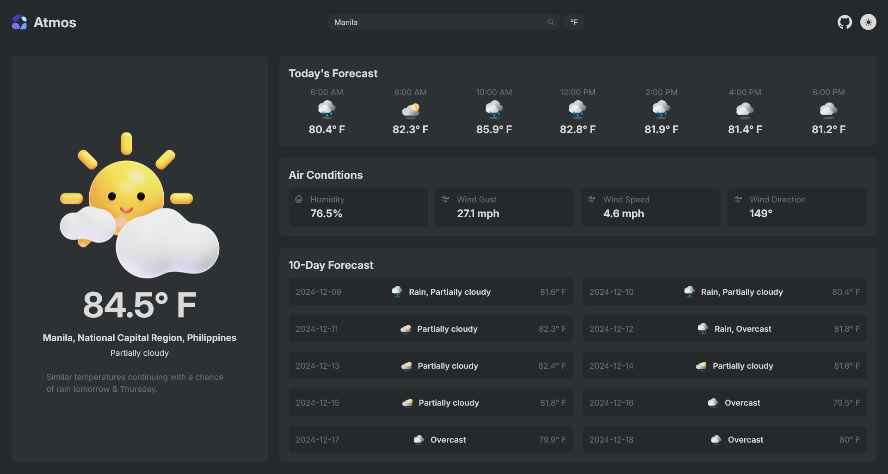
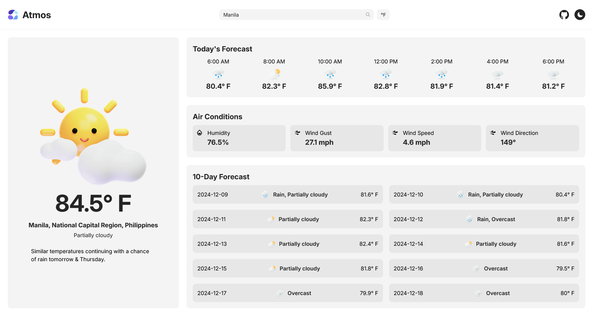

<h1 align="center">
  
  <br>
  Atmos
</h1>

<h4 align="center">A sleek and modern weather app for weather forecasts</h4>

<div align="center">


</div>




## 🌟 Show Your Support

Your star on GitHub can help others discover Atmos. If you enjoy using it, consider leaving a star on this GitHub repo.

Your support means a lot! 🌟

## 🚀 How To Use

To clone and run this application, you'll need [Git](https://git-scm.com) and [npm](http://npmjs.com) installed. Follow these steps:

```bash
# Clone this repository
$ git clone https://github.com/arvincodes/atmos.git

# Navigate into the project directory
$ cd atmos

# Install project dependencies
$ npm install

# Install Webpack and related development dependencies
$ npm install --save-dev webpack webpack-cli
$ npm install --save-dev html-webpack-plugin
$ npm install --save-dev style-loader css-loader
$ npm install --save-dev html-loader
$ npm install --save-dev mini-css-extract-plugin

# Start the development server
$ npm run dev
```

## 📝 Attributions

<ul>
<li>2d weather icons by <a href="https://www.figma.com/community/file/971051749541378755" target="_blank">Neelesh Chaudhary</a></li>
<li>3d weather icons by <a href="https://www.figma.com/community/file/1023658389987124693" target="_blank">Mikołaj Niżnik</a></li>
<li>Logo inspired from <a href="https://dribbble.com/shots/24759244-a" target="_blank">Yoga Perdana</a></li>
</ul>
